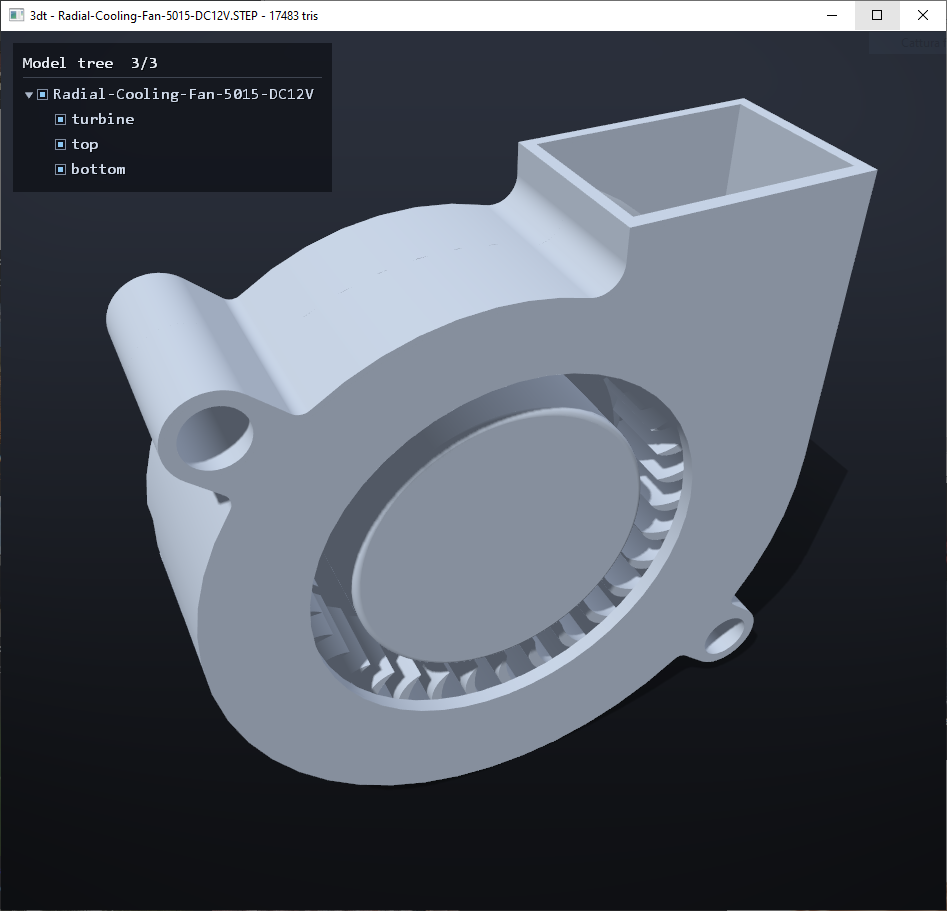

# 3dt — STL / STEP / OBJ Viewer

A fast, dependency-free 3D model viewer written in **C++17** with **native Win32 + OpenGL 3.3**.
No GLFW, no GLEW, no Assimp, no OpenCASCADE: every parser, the WGL context bootstrap, the GL
extension loader and the renderer are implemented from scratch. The result is a single
statically-linked executable (~1.3 MB) that runs on any Windows machine with no runtime
dependencies.



## Features

### File formats — all parsers written from scratch
- **STL** — ASCII and binary, with robust auto-detection (handles binary files whose header
  starts with `solid`), chunked reading for multi-million-triangle files.
- **STEP** (`.step` / `.stp`, ISO 10303-21, AP203/AP214/AP242) — a real B-rep tessellator:
  - Part 21 parser with full value trees, complex multi-type instances, malformed-input resync.
  - Surfaces: plane, cylinder, cone, sphere, torus, linear extrusion, surface of revolution,
    B-spline/NURBS (all knot variants, rational via complex entities).
  - Curves: line, circle, ellipse, polyline, trimmed curve, B-spline (all variants, rational).
  - Full trimming: edges projected to UV space, seam unwrapping on periodic surfaces, hole
    bridging, ear-clipping triangulation, conforming refinement (no T-junctions), analytic
    per-vertex normals for smooth curved surfaces.
  - Unknown faces are skipped gracefully — malformed files never crash the viewer.
- **OBJ** — all index forms (`v`, `v/vt`, `v//vn`, `v/vt/vn`, negative indices), quad/n-gon fan
  triangulation, smooth normals from `vn` with geometric fallback, fast buffer-based parsing.

### Rendering
- OpenGL **3.3 core profile** with a hand-written WGL bootstrap and extension loader,
  automatic fallback to legacy fixed-function on old GPUs.
- **MSAA 8x** (fallback 4x/off), vsync, gamma-correct two-light Blinn-Phong shading,
  gradient background, two-sided lighting (handles mixed-winding CAD meshes).
- **Shadow mapping** with 3×3 PCF soft shadows: self-shadowing plus a ground shadow-catcher
  plane. Toggle at runtime.
- **Section views**: three axis-aligned clipping planes (X/Y/Z), independently toggleable,
  position adjustable across the model, flippable side. Applied to shadows too.
- On-screen **help overlay** and **model info panel** (triangle/vertex count, bounding box)
  rendered with a GL text atlas.
- **Model tree panel** for multi-part STEP assemblies: expand/collapse groups, per-part
  show/hide checkboxes (shadows follow), scrollable, double-click a row to fit the view
  on that part.
- Single draw call per pass — smooth interaction with multi-million-triangle meshes.

## Controls

| Input | Action |
|---|---|
| Drag & drop a file onto the window (or onto `3dt.exe`) | Open model |
| Left drag / Right drag / Wheel | Orbit / Pan / Zoom |
| Double click or `F` | Fit model to view |
| `W` | Wireframe on/off |
| `S` | Smooth / flat shading |
| `G` | Grid on/off |
| `O` | Shadows on/off |
| `H` | Help overlay on/off |
| `I` | Model info panel on/off |
| `T` | Model tree panel on/off (multi-part STEP assemblies) |
| `X` / `Y` / `Z` | Toggle section plane on that axis |
| Hold `X`/`Y`/`Z` + Wheel | Move the section plane |
| `Shift` + `X`/`Y`/`Z` | Flip the cut side |
| `F11` | Fullscreen on/off |
| `Ctrl+O` | Open file dialog |
| `ESC` | Quit |

## Building

No third-party libraries on either platform: the platform layer (window, GL context,
input, drag&drop) is hand-written — Win32/WGL on Windows, Xlib/GLX on Linux.

### Windows (MinGW-w64)

Requires a MinGW-w64 toolchain (tested with GCC 15).

```sh
# with GNU make
mingw32-make            # release -> build/3dt.exe
mingw32-make DEBUG=1    # debug build

# or with CMake
cmake -S . -B build-cmake -G "MinGW Makefiles" -DCMAKE_BUILD_TYPE=Release
cmake --build build-cmake
```

The executable is fully static (`-static`): it can be copied to any Windows PC as-is.

```sh
build/3dt.exe path/to/model.step   # optional: open a file at startup
```

### Linux (X11/GLX)

Requires a C++17 compiler, CMake, and the X11 + OpenGL development packages.
On Debian/Ubuntu:

```sh
sudo apt install build-essential cmake libx11-dev libgl1-mesa-dev
```

Then build with CMake (links against `-lX11 -lGL` only):

```sh
cmake -S . -B build-cmake -DCMAKE_BUILD_TYPE=Release
cmake --build build-cmake
./build-cmake/3dt path/to/model.step
```

The Ctrl+O file dialog uses `zenity` or `kdialog` when installed; without them, open
files via drag&drop (XDND) or the command line. Note: development happened on
Windows — the Linux backend compiles against Xlib/GLX but still needs testing on a
real Linux machine.

## Project layout

```
src/
  mesh.h / mesh.cpp        shared triangle-soup mesh + bounds/normals helpers
  stl_loader.cpp           STL parser (ASCII + binary)
  obj_loader.cpp           Wavefront OBJ parser
  step_internal.h          STEP geometry model shared by the two STEP units
  step_loader.cpp          ISO 10303-21 (Part 21) parser + entity graph
  step_tess.cpp            surface evaluation, trimming, triangulation
  gl_loader.h / .cpp       manual OpenGL 3.3 function loader (proc address injected)
  renderer.h / .cpp        shaders, shadow mapping, camera, sections (platform-free)
  overlay.h / .cpp         2D text/panel pipeline over a platform font atlas
  platform.h               abstract platform interface (window, GL, input, dialogs)
  platform_win32.cpp       Win32/WGL/GDI backend
  platform_x11.cpp         Linux Xlib/GLX backend (XDND, EWMH, built-in bitmap font)
  app.cpp                  portable app logic: input commands, file dispatch
test/                      sample models (STL ASCII/binary, STEP incl. assemblies, OBJ)
```

## Known limitations

- STEP: `OFFSET_SURFACE` and composite curves are not supported (such faces are skipped and
  counted); units are ignored (the viewer auto-fits the model).
- OBJ: materials/textures (`.mtl`, `vt`) are parsed but ignored; n-gons are fan-triangulated
  (convex polygons only).
- Section views render the interior hollow (no cap fill on the cut plane).
- The Linux (X11/GLX) backend compiles but was developed on Windows and still needs
  testing on a real Linux machine.

## License

**GNU General Public License v3.0** — see [LICENSE](LICENSE).

Copyright (C) Manuel Finessi
